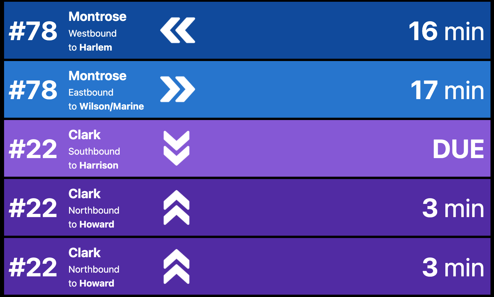

# Chicago CTA Bus/Train Display Panel

Displays approaching buses and trains using the Chicago Transit Authority APIs. The bus and train APIs are slightly different and each require their own key.

-----

## Installation
This project has been tested on Amazon Web Services. There is a `amplify.yml` deployment file built in for easy hosting on Amplify. In addition to the Amplify build script there are serverless Lambda functions in the `/lambda` folder, deploy these to your cloud accound and set them up with configuration settings below.

-----

## Bus API
[This PDF is the official documentation](https://www.transitchicago.com/assets/1/6/cta_Bus_Tracker_API_Developer_Guide_and_Documentation_20160929.pdf) for the bus API. You can [request an API key by registering](https://www.transitchicago.com/developers/bustracker/) on the transitchicago.com site, they directly email the keys and the process can take 1-2 weeks from the time you request it.

## Lambda Endpoint: fetch-buses-python
### Expected Environment Variables / Inputs

-----

| Type | Name | Description |
| ------------- | ------------- | ----------- |
| Environment | CTA_BUS_KEY | API key from the CTA. |
| GET | route | Route ID. [Use the bus tracker site to select your stop](http://www.ctabustracker.com/bustime/wireless/html/home.jsp) and pull the route identifier out of the URL ("route"). |
| GET | stops | Stop(s). Multiple stops are comma separated [Use the bus tracker site to select your stops](http://www.ctabustracker.com/bustime/wireless/html/home.jsp) and pull the stop identifier out of the URL ("id").  |

-----

